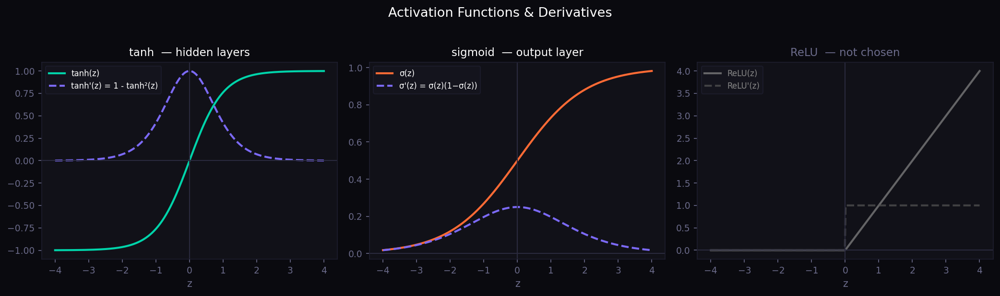
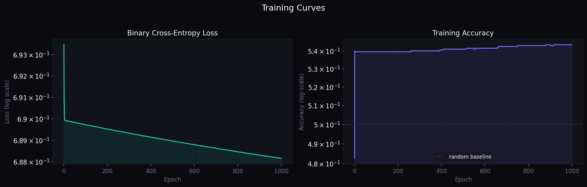

# Deep Learning

A collection of deep learning implementations and explorations grounded in rigorous mathematical foundations.

## References

**Primary:** *Deep Learning Architectures: A Mathematical Approach* — Ovidiu Calin  
**Secondary:** *Mathematical Theory of Deep Learning* — Petersen & Zech

---

## Contents

### [`momentum_optimization.ipynb`](./momentum_optimization.ipynb)
Explores momentum-based optimization methods for training neural networks. Covers the theoretical motivation for momentum, its effect on convergence speed and stability compared to vanilla gradient descent, and empirical demonstrations on benchmark loss landscapes.

- Gradient descent vs. momentum update rules
- Convergence analysis and learning rate interaction
- Visualizations of optimization trajectories

**Companion export:** [`momentum_optimization.pdf`](./momentum_optimization.pdf)

---

### [`sp_returns_deep_neural_network.ipynb`](./sp_returns_deep_neural_network.ipynb)
Applies a deep neural network to model and predict S&P 500 returns. Bridges theoretical deep learning with a practical financial time-series use case.

- Network architecture design for return prediction
- Training pipeline with loss tracking
- Evaluation of model performance on held-out data

---

## Visualizations

| Activation Functions | Training Curves |
|---|---|
|  |  |

---

## Setup

```bash
# Clone the repo
git clone https://github.com/jadams1313/deep-learning.git
cd deep-learning

# Install dependencies
pip install numpy matplotlib torch scikit-learn jupyter

# Launch notebooks
jupyter notebook
```

---

## Topics Covered

- Activation functions and their mathematical properties
- Gradient descent and momentum-based optimizers
- Deep neural network architectures
- Financial time-series modeling with deep learning
- Training dynamics and convergence behavior

---

## Author

**Jake Adams** — Pennsylvania State University, Data Science  
[GitHub](https://github.com/jadams1313)
